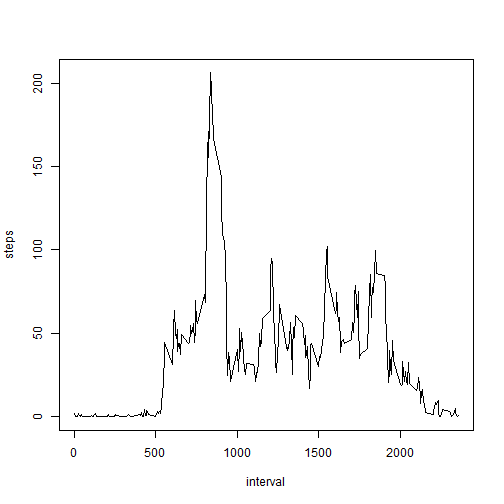

# Reproducible Research: Peer Assessment 1

## Loading and preprocessing the data

```r
data <- read.csv("activity.csv", header = TRUE, colClasses=c("numeric", "character", "numeric"))
data$date <- as.Date(data$date , "%Y-%m-%d")	# Date in usable format.
data_no_na <- na.omit(data)
```


## What is mean total number of steps taken per day?
Calculate the total number of steps taken per day

```r
steps_per_day <- aggregate(steps ~ date, data_no_na, sum)
```
Histogram of the total number of steps taken each day

```r
hist(steps_per_day$steps, main="Total number of steps taken each day", xlab="Number of steps", col="blue")
```

 

The mean and median of the total number of steps taken per day

```r
mean(steps_per_day$steps)
```

```
## [1] 10766.19
```

```r
median(steps_per_day$steps)
```

```
## [1] 10765
```


## What is the average daily activity pattern?
Time series plot (i.e. type = "l") of the 5-minute interval (x-axis) and the average number of steps taken, averaged across all days (y-axis)

```r
avg_num_steps <- aggregate(x=list(steps=data_no_na$steps), by=list(interval=data_no_na$interval), mean)
plot(avg_num_steps, type = "l")
```

 

Which 5-minute interval, on average across all the days in the dataset, contains the maximum number of steps?

```r
avg_num_steps[which.max(avg_num_steps$steps),]
```

```
##     interval    steps
## 104      835 206.1698
```


## Imputing missing values

Total number of missing values in the dataset (i.e. the total number of rows with NAs)

```r
sum(is.na(data$steps))
```

```
## [1] 2304
```

To fill the missing data, the average 5 minute interval value will be used.

A new dataset that is equal to the original dataset but with the missing data filled in:

```r
data_na_imputed <- data
for (i in 1:nrow(data_na_imputed))
{
	if (is.na(data_na_imputed[i, "steps"]))
	{
		data_na_imputed[i, "steps"] <- round(
			avg_num_steps[avg_num_steps$interval ==	as.integer(data_na_imputed[i, "interval"]), "steps"]
			)
	}
}
```

Histogram of the total number of steps taken each day:

```r
steps_per_day_no_na <- aggregate(steps ~ date, data_na_imputed, sum)
hist(steps_per_day_no_na$steps, main="Total number of steps taken each day after missing values are impouted",
		xlab="Number of steps", col="blue")
```

 

Mean and median steps per day with imputted values:


```r
mean(steps_per_day_no_na$steps)
```

```
## [1] 10765.64
```

```r
median(steps_per_day_no_na$steps)
```

```
## [1] 10762
```

The rounded mean is basically the same, considering someone cannot take a partial step.
The median changes by 3 steps, which is minimal considering the amount of steps taken each interval.


## Are there differences in activity patterns between weekdays and weekends?

Create a new factor variable in the dataset with two levels – “weekday” and “weekend” indicating whether a given date is a weekday or weekend day.

```r
day_type <- function(date)
{
	if (weekdays(date) %in% c("Saturday", "Sunday"))
	{
		return ("weekend")
	}
	else
	{
		return ("weekday")
	}
}
data_na_imputed$day_type <- sapply(data_na_imputed$date, day_type)
```

Make a panel plot containing a time series plot (i.e. type = "l") of the 5-minute interval (x-axis) and the average number of steps taken, averaged across all weekday days or weekend days (y-axis). See the README file in the GitHub repository to see an example of what this plot should look like using simulated data.


```r
day_type_average <- aggregate(steps ~ interval + day_type, data_na_imputed, mean)

# Here I use lattice instead of base plot to look like the one provided as an example in the readme.
library(lattice)
xyplot(steps ~ interval | day_type, day_type_average, type = "l", layout = c(1,2), xlab = "Interval", ylab = "Number of steps")
```

 
